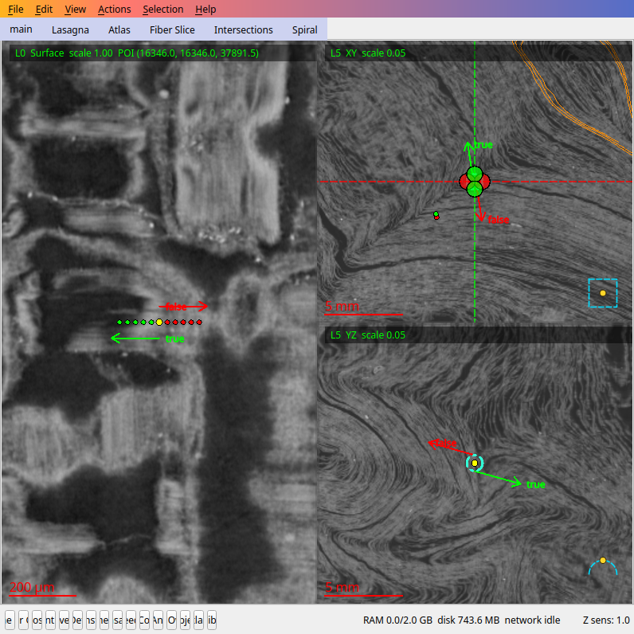

# Work on Herculaneum scrolls with ZERO downloads

**Segment, render and edit scroll data streamed straight from the Vesuvius Challenge
open-data servers — no multi-terabyte downloads, no credentials, no cluster.**

The official volumes are multi-TB, but they are published as chunked multiscale
OME-Zarr: every tool in this guide reads only the ~128³ chunks it actually touches,
on demand, over anonymous HTTPS/S3. A laptop with a few GB of disk is enough to
grow real segments on an 11-metre scroll scan.

Everything below was **run and verified against live open data**
(`villa` main @ `aab644c9c`, 2026-08-15/16, PHercParis4; §2–§3 re-run on main
`df05b9634`, 2026-08-21). Commands are copy-paste.
Sections that depend on fixes still under review are marked **[requires PR #x]**.


*A live session: a published segment's L0 surface view (left) and slice views (right),
every voxel streamed on demand. `disk 743 MB`, not 15 TB.*

---

## 0. What you need

- A VC3D build (Ubuntu 24.04 works; deps + build ≈ 30 min):

```bash
git clone https://github.com/ScrollPrize/villa
cd villa/volume-cartographer
sudo bash scripts/install_build_deps.sh        # or the vc3d-deps container
cmake -S . -B build -GNinja -DCMAKE_BUILD_TYPE=Release -DVC_BUILD_APPS=ON
ninja -C build
```

- Nothing else. All data access below is anonymous.

## 1. Where the data lives (60-second orientation)

- Root catalog: `https://vesuvius-challenge-open-data.s3.amazonaws.com/metadata.json`
  — **gzip-compressed without a `.gz` suffix**: `gzip.decompress()` before `json.loads()`.
  Lists every sample → scan → volume/segment/prediction artifact, with transforms.
- Volumes: `<bucket>/<sample>/volumes/<id>.zarr` — multiscale, chunked 128³,
  levels `0..5`. Both `https://` and `s3://` (anonymous) work everywhere below.
- A useful small starter volume (4066×2264×2264, ~binned 45.532 µm, streams fast):

```
https://vesuvius-challenge-open-data.s3.amazonaws.com/PHercParis4/volumes/20260310173927-45.532um-11.0m-110keV-masked.zarr
```

## 2. Grow a segment on a streamed volume (CLI, one command)

`vc_grow_seg_from_seed` accepts a remote URL directly:

```bash
cat > params.json <<'EOF'
{"mode": "seed", "cache_size": 2000000000, "generations": 8, "thread_limit": 4}
EOF

build/bin/vc_grow_seg_from_seed \
  -v "https://vesuvius-challenge-open-data.s3.amazonaws.com/PHercParis4/volumes/20260310173927-45.532um-11.0m-110keV-masked.zarr" \
  -t out/ -p params.json --seed 1408 1408 1024
```

Verified output: `voxelsize: 45.532` picked up from remote metadata automatically,
a real `auto_grown_*` tifxyz segment saved in `out/` (x/y/z.tif + meta.json +
generations.tif). Interrupting mid-run is safe — the save is atomic at the end;
a killed run leaves nothing partial. Resume and extend a saved segment with
`--resume out/auto_grown_* --resume-generations 4` (verified: reconverges), or
rewind a growth with `--rewind-gen N`.

Seeds must land on papyrus: pick a bright voxel in any slice viewer, or use the
one above for this volume. `generations` controls patch size (8 ≈ 1.4 cm² in
seconds; 30 ≈ 10 cm² in ~1 min on 4 threads).

## 3. Render a streamed segment to images

Unlike the grow tool, the renderer takes the remote URL via `--remote-url`.
`-v/--volume` is still **required**, but when you stream it is only consulted as
a fallback source — it is never created, populated or reused — so point it at any
empty directory:

```bash
mkdir -p render_cache
build/bin/vc_render_tifxyz \
  -v render_cache \
  --remote-url "https://vesuvius-challenge-open-data.s3.amazonaws.com/PHercParis4/volumes/20260310173927-45.532um-11.0m-110keV-masked.zarr" \
  -s out/auto_grown_*/ --scale 1 -g 0 --voxel-size 45.532 --tif-output render/
```

Verified: streams only the chunks the surface crosses and writes per-slice TIFFs
(the 1.4 cm² patch from §2 renders 360×360 with real papyrus texture in seconds).
Notes:

- **A streamed render keeps nothing on disk.** Re-measured on main `df05b9634`:
  a full 360×360 render streamed its 3 bands in ~7 s and left *zero* new files in
  both the `-v` directory and `~/.VC3D`. The chunk cache is RAM-only, sized by
  `--cache-gb`. That is exactly what you want for zero-download work, but it also
  means there is no on-disk reuse — each run re-streams the chunks it needs.
- `--prefetch-remote` fetches every chunk the surface crosses in one planned
  batch *before* rendering starts (measured on the §2 patch: `Prefetch: 27
  chunk(s)`, render phase 0.9 → 71.9 bands/s). It moves the wait rather than
  removing it: on this small surface the total run was **slower** (12.5 s vs
  7.1 s), because lazy streaming overlaps fetching with rendering. Expect it to
  pay off only on large surfaces where batched fetches beat serial ones — and it
  persists nothing either. Its help text mentions an "existing staged cache",
  and `--remote-url`'s help calls itself optional "if `--volume` cache already
  records it" via a `.remote_source.json` marker; nothing in the repository ever
  writes that marker, so both of those paths are currently unreachable.
- **Pass `--voxel-size` explicitly for streamed volumes.** On current main a
  streaming-only setup finds no local metadata and falls back to
  `Voxel size: 1.0` with a warning, which mis-scales physical units downstream
  **[auto-discovery: requires open [PR #1417](https://github.com/ScrollPrize/villa/pull/1417)]**.
- `-g/--group-idx` selects the pyramid level. Some newer prediction volumes
  publish only coarse levels ("sparse pyramids") — requesting an absent level
  currently produces an all-black render with exit 0
  **[fail-fast guard: requires open [PR #1344](https://github.com/ScrollPrize/villa/pull/1344)]**; if your render is black, try
  `-g 2` and up.
- `--cache-gb` defaults to 16 — lower it on small machines/containers
  (see [villa#1404](https://github.com/ScrollPrize/villa/issues/1404) / open [PR #1415](https://github.com/ScrollPrize/villa/pull/1415)).

## 4. Drive the whole workflow from VC3D (GUI or fully headless)

VC3D's Open Data catalog does everything in-app: browse samples, stream volumes,
fetch published segments, grow patches, edit. The same surface is scriptable
through the **agent bridge** — VC3D's JSON-RPC control channel (119 methods) —
which is how every transcript in this guide was captured:

```bash
QT_QPA_PLATFORM=offscreen build/bin/VC3D --agent-bridge --agent-bridge-name demo
# stdout prints:  VC3D-AGENT-BRIDGE: listening ... path=<socket>
```

Newline-delimited JSON-RPC 2.0 over that Unix socket (or use the bundled
`tools/vc3d-mcp` MCP server to drive it from an AI agent). The verified
zero-download session, end to end:

```
catalog.open_sample   {"sampleId":"PHercParis4","resources":{"kinds":[]}}   → async job; poll job.status
volume.list / volume.select {"volumeId":"20260310170716-45.532um-…"}
segments.list                             → 81 published segments, fetch on demand
segments.fetch    {"segmentId":"2023…"}   → streams one segment (~57 MB), cached
segments.activate {"segmentId":"2023…"}
segment.generate_mask + segment.recalc_area  → 92.18 cm² for the classic 20230702185753
segmentation.grow_patch_from_seed {"seed":{"x":1408,"y":1408,"z":1024},"iterations":30}
segments.activate the new auto_grown_*    → then:
segmentation.enable_editing {"enabled":true}   → grow / manual_add / push_pull / save
screenshot.capture                        → the PNG at the top of this page
```

Notes for `catalog.open_sample`: `resources.kinds` filters *derived* artifacts
(`"normal_grids" | "lasagna" | "prediction"`); raw volumes always attach, so
`"kinds": []` = volumes only, fastest open.

### Current sharp edges (streamed-project specifics, all reported upstream)

- Don't **rename** a fetched published segment — it orphans the cached copy on
  restart and forces a silent re-download ([villa#1464](https://github.com/ScrollPrize/villa/issues/1464)).
- `segmentation.enable_editing` on a *published* segment hangs headlessly (the
  immutable-cache prompt is a GUI modal, [villa#1465](https://github.com/ScrollPrize/villa/issues/1465)). Edit your own grown patches —
  that path works end-to-end — or create an editable copy in the GUI first.
- Patches you grow inside an Open Data project don't reappear after a restart
  ([villa#1466](https://github.com/ScrollPrize/villa/issues/1466)). Your data is safe on disk under
  `~/.VC3D/remote_cache/open_data/segments/<sample>/patches/`; re-attach it with
  `segments.attach {"location": <that path>}` (or grow any new patch, which
  re-attaches the folder).
- `fiber.create_atlas` can't run on catalog-streamed samples yet: published
  lasagna manifests carry no `init_shell_dir`, and there is no local-shell
  override ([villa#1530](https://github.com/ScrollPrize/villa/issues/1530)). Fiber import/list/export and tracing channels work.
- Streaming AI-prediction channels (Lasagna) into the catalog project **works on
  current main** (fixed 2026-08-19 by [PR #1527](https://github.com/ScrollPrize/villa/pull/1527), verified cold on PHerc0125: all four
  channel volumes attach), with correct level registration from [PR #1347](https://github.com/ScrollPrize/villa/pull/1347) (merged).
  On builds older than `bf57b86` the attach fails deterministically
  ([villa#1355](https://github.com/ScrollPrize/villa/issues/1355)) — rebuild from main if you hit `no .zarray or zarr.json found`.

### Bonus: the Lasagna fit service runs on streamed catalog data too

With a catalog sample open (§4), the fit-optimizer service can be started and
fed entirely from the streamed cache — no local dataset preparation:

```
# fit_service.py isn't found from a custom build dir; point VC3D at it:
LASAGNA_SERVICE_PATH=<villa>/lasagna/fit_service.py  QT_QPA_PLATFORM=offscreen  ./VC3D --agent-bridge ...

lasagna.ensure_service {"pythonPath": "<venv-with-torch>/bin/python"}
   → service starts and auto-discovers the cached catalog manifest as its dataset
lasagna.list_datasets            → the sample's .lasagna.json, served from the cache
lasagna.start_optimization {"mode": "new_model", "seed": {...},
                            "configPath": "<villa>/lasagna/configs/init_corr.json"}
   → job queued; poll lasagna.jobs
```

Every step above was live-verified on PHerc0332 (main `bf57b86`). `configPath`
is required headlessly — without it you get `Lasagna config not found: (none
selected)`. Two env prerequisites: the service venv needs `tensorstore`, and
the first fit JIT-compiles a small CUDA kernel, so a CUDA toolkit matching
your torch build must be on `CUDA_HOME` (the service deliberately refuses CPU
fallback; job errors stay queryable in `lasagna.jobs`).

On today's *published* artifacts a from-scratch fit still stops at manifest
gaps — no `init_shell_dir`, empty `umbilicus_json`, and a store-layout mismatch
between VC3D's cache and the fit's loader
([villa#1530](https://github.com/ScrollPrize/villa/issues/1530) /
[villa#1540](https://github.com/ScrollPrize/villa/issues/1540)). The chain
itself is proven whole: with those gaps hand-composed, a full 3-stage
`new_model` fit **completes** on streamed PHerc0332 data (~20–25 it/s on an
RTX 3060, 6.5 MiB streamed per channel, exported tifxyz landing back in the
project) — the constructive run is written up in the villa#1540 thread.

## 5. Stream chunks yourself (Python, 5 lines)

For analysis outside VC3D, plain `zarr` + anonymous S3 streams the same data:

```python
import zarr
vol = zarr.open(
    "s3://vesuvius-challenge-open-data/PHercParis4/volumes/20260310173927-45.532um-11.0m-110keV-masked.zarr",
    mode="r", storage_options={"anon": True})
slab = vol[0][1000:1032, 1200:1456, 1200:1456]   # streams ~8 chunks, nothing else
```

Level `0` is native resolution; `1..5` halve each axis per step. The same works
over plain HTTPS with `fsspec`. For catalog-wide integrity checking of what you
stream, see [`scroll-data-audit`](https://github.com/Bullo27/scroll-data-audit)
(and the mesh-side audit in [villa#1468](https://github.com/ScrollPrize/villa/issues/1468) that extends it).

---

## Provenance & disclosure

Written from live, executed sessions against the public open-data servers
(main @ `aab644c9c`, Aug 2026; §2–§3 re-verified on `df05b9634` after the
remote-cache rewire in [PR #1554](https://github.com/ScrollPrize/villa/pull/1554));
every command and number above comes from an
actual run, and the sharp-edges list links the upstream issue for each caveat.
Prepared by Matteo Bulloni with AI assistance (Claude) as part of ongoing
tooling/data-integrity work on the Vesuvius Challenge.
